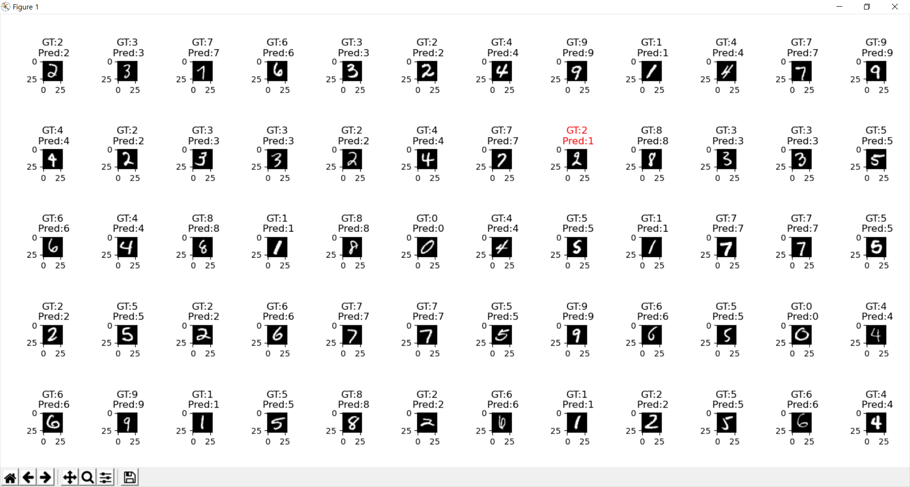

# MNIST Handwriting Images Classifier

An MNIST handwriting images classifier implemented using `numpy` and Convolutional Neural Network(CNN).

## Network Architecture

Overall architecture of the network is shown above.

### Layer 1: Convolutional Layer

* Input shape: `(B, 1, 28, 28)`
* Output shape: `(B, 28, 26, 26)`
* Class: `nn_layers.nn_convolutional_layer`
* Details: convolution with 28 filters of shape `(3, 3, 1)`

### Layer 2: Activation Layer

* Input shape: `(B, 28, 26, 26)`
* Output shape: `(B, 28, 26, 26)`
* Class: `nn_layers.nn_activation_layer`
* Details: ReLU function is used

### Layer 3: Maxpool Layer

* Input shape: `(B, 28, 26, 26)`
* Output shape: `(B, 28, 13, 13)`
* Class: `nn_layers.nn_activation_layer`
* Details: 2x2 maxpooling with stride 2

### Layer 4: FC(Fully Connected) Layer

* Input shape: `(B, 28, 13, 13)`
* Output shape: `(B, 128)`
* Class: `nn_layers.nn_fc_layer`
* Details: Flattens input, i.e. considers input as `B` vectors of size 28 × 28 × 13=4732.

### Layer 5: Activation Layer

* Input shape: `(B, 128)`
* Output shape: `(B, 128)`
* Class: `nn_layers.nn_activation_layer`
* Details: ReLU function is used

### Layer 6: FC(Fully Connected) Layer

* Input shape: `(B, 128)`
* Output shape: `(B, 10)`
* Class: `nn_layers.nn_fc_layer`

### Layer 7: Softmax Layer

* Input shape: `(B, 10)`
* Output shape: `(B, 10)`
* Class: `nn_layers.nn_softmax_layer`

### Loss Function

* Class: `nn_layers.nn_cross_entropy_layer`
* Details: Cross-entropy loss function is used

## Training and Test Results

Among 60k MNIST training images, 50k images were used for training and 10k images were used for validation. The model was trained for 2 epochs, with 48 iterations for each epoch, total 96 iterations, with batch size of 1024.

The training was tried four times, and average training time was 302.5(5min 2.5sec) ± 1.5 seconds. Loss graph over iterations for each trial is shown below.

10k images from MNIST test images were used for test. Average test accuracy was 97.27 ± 0.43%. Some prediction results are shown below.

## License and Disclaimer
* The project was submitted for an assignment in COSE474 Deep Learning course, and is no longer maintained.
* Redistribution of source code is permitted, but the following consequences is your responsibility.
